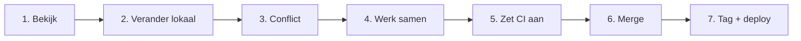

# Demo — Git & CI/CD voor Ignition

Welkom. Deze guide vertelt het verhaal van één kleine Perspective-wijziging. Neem rustig de tijd; na elke stap zie je zowel wat Git doet als wat dat betekent voor Ignition.

1. [Bekijk de Perspective-bestanden](demo/01-bekijk-de-perspective-view.md)
2. [Maak een lokale wijziging en stuur die naar Ignition](demo/02-lokale-wijziging-naar-ignition.md)
3. [Ervaar en los een eenvoudig merge conflict op](demo/03-eenvoudig-conflict-op-dev.md)
4. [Werk prettiger samen met feature branches en Pull Requests](demo/04-samenwerken-met-feature-branches.md)
5. [Zet CI aan en zie rood daarna groen](demo/05-ci-aan-rood-groen.md)
6. [Merge `dev` naar `main`](demo/06-merge-dev-naar-main.md)
7. [Maak een Git tag en deploy naar productie](demo/07-tag-en-deploy-naar-productie.md)

> Bewerk tijdens de demo alleen `view.json`. `resource.json` is Ignition-metadata en leidt af van wat je wilt laten zien.
