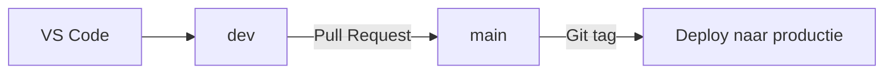
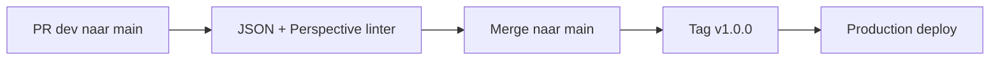

# Ignition Git & CI/CD demo

Dit is een kleine, veilige oefenrepository. Je volgt één Perspective-view van een wijziging in VS Code naar een productie-Gateway.



## De twee vaste branches

- `dev` is de gezamenlijke ontwikkelbranch. Hier komen oefenwijzigingen samen.
- `main` is de productiebranch. Alleen een geteste wijziging uit `dev` komt hier.

Een release gebeurt niet zomaar bij elke merge. Nadat een PR van `dev` naar `main` groen is en gemerged is, hang je een tag zoals `v1.0.0` aan die `main`-commit. Die tag start de productie-deploy.

## Eenmalig: Gateways starten

Installeer Docker Desktop, Git, VS Code en Git Bash. Maak jouw lokale instellingenbestand:

```bash
cp .env.example .env
```

Open `.env` en kies een eigen waarde voor `GATEWAY_ADMIN_PASSWORD`. Deel of commit dit bestand nooit.

Start vervolgens de Gateways:

```bash
docker compose up -d --wait
```

Het eerste commando wacht totdat Ignition zelf `RUNNING` meldt. Daarna kun je openen:

- Local Gateway: `http://localhost:8088`
- Local Perspective-view: `http://localhost:8088/data/perspective/client/demo-project/`
- Production Gateway: `http://localhost:8090`

Stoppen:

```bash
docker compose down
```

## Eenmalig: branches maken

Nadat je `main` naar GitHub hebt gepusht, maak je één keer `dev`:

```bash
git switch main
git push -u origin main
git switch -c dev
git push -u origin dev
```

## Wat doen CI en CD?



- **CI** controleert de bestanden vóór de merge.
- **CD** kopieert de bestanden van de getagde `main`-commit naar de productiecontainer en vraagt Ignition daarna om een projectscan.

## Eenmalig: automatische productie-deploy instellen

Voor de productie-deploy start Docker tijdelijk een self-hosted GitHub Actions-runner. Die heeft toegang tot dezelfde Docker daemon als de Gateway, voert precies één release-job uit en stopt daarna. Je hoeft in GitHub dus geen runner via de webinterface te registreren.

Stel de twee verschillende sleutels in deze volgorde in:

1. Maak na het starten van de production Gateway via **Config → Security → API Keys** een **Ignition API key**. `scripts/deploy.sh` gebruikt die alleen om Ignition na het kopiëren om een beveiligde projectscan te vragen.
2. Maak in GitHub via **Settings → Developer settings → Personal access tokens → Tokens (classic) → Generate new token (classic)** een **GitHub Personal Access Token (PAT)**. Dit is een GitHub API-toegangstoken, geen Ignition-key. Kies nadrukkelijk **niet** voor een fine-grained token en vink bij de classic token de volledige scope **`repo`** aan. De tijdelijke runnercontainer gebruikt deze PAT om bij GitHub een kortlevende registratie voor precies deze repository aan te vragen.
3. Zet beide sleutels en de repository-URL alleen in jouw lokale `.env`:

```text
IGNITION_API_KEY=jouw-productie-api-key
RUNNER_REPO_URL=https://github.com/jouw-gebruikersnaam/ignition-cicd-demo
RUNNER_GITHUB_PAT=ghp_jouw_token
```

`.env` staat in `.gitignore`; commit of deel deze waarden niet. Na de demo kun je de runnercontainer verwijderen en de GitHub PAT intrekken.

## De demo geven

Open [DEMO.md](DEMO.md). De zeven korte bestanden zijn geschreven als een rustige guide: ze vertellen wat je ziet, waarom je een stap doet en welke commando’s je kunt kopiëren.
