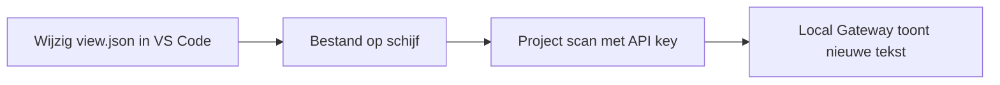

# 2. Maak een lokale wijziging en stuur die naar Ignition

Nu maken we één kleine wijziging in VS Code. Daarna vertellen we de lokale Gateway expliciet dat hij de gewijzigde bestanden opnieuw moet lezen.



## Maak eerst een API key voor de lokale scan

Open de Local Gateway en log in:

```text
http://localhost:8088
```

Ga naar **Platform → Security → API Keys** en maak een nieuwe API key. Geef hem bijvoorbeeld de naam `local-project-scan`. Belangrijk is dat `Require secure connections for API Keys = False` moet zijn. Kopieer de volledige key direct, want na het aanmaken is hij niet opnieuw zichtbaar.

De key heeft ook een schrijfrecht nodig voor de scan. Dit stel je één keer als volgt in:

1. Ga naar **Platform → Security → Levels** en maak onder `Public` een nieuw level, bijvoorbeeld `ApiScan`.
2. Ga naar **Platform → Security → General Settings**.
3. Zoek **Gateway Write Permissions**, kies `at least one of` en selecteer `ApiScan`.
4. Ga naar **Platform → Security → API Keys** en maak een nieuwe API key en geef hem bijvoorbeeld de naam `local-project-scan`. Zet **Require secure connections for API Keys** naar False en selecteer onder **Security Level** `ApiScan`. Kopieer de volledige key direct, want na het aanmaken is hij niet opnieuw zichtbaar.

Alleen `Authenticated` is niet voldoende voor deze schrijfactie. Zonder het schrijfrecht geeft de scan HTTP 403 terug.

Open `.env` in VS Code en vul deze regel in:

```text
IGNITION_API_KEY_LOCAL=plak-hier-de-volledige-api-key
```

Sla `.env` op. Dit bestand staat in `.gitignore`, dus de key komt niet in Git terecht.

## Maak de wijziging

Open de production-view en om de oorspronkelijke pagina te zien:

```text
http://localhost:8088/data/perspective/client/demo-project/
```

Ga terug naar `view.json`. Verander alleen deze tekst:

```text
Machine: Demo
```

naar:

```text
Machine: Oefening
```

Je kunt nu eerst zien wat Git heeft opgemerkt:

```bash
git status
git diff
```

Stuur de wijziging vervolgens naar de lokale Gateway:

```bash
bash scripts/scan-local.sh
```

Ververs de lokale Perspective-pagina. De tekst `Machine: Oefening` is nu zichtbaar.

Tot slot slaan we deze oefening op in `dev`:

```bash
git switch dev
git add projects/demo-project/com.inductiveautomation.perspective/views/demo/view.json
git commit -m "demo: change machine label locally"
git push origin dev
```

Hier zie je het verschil tussen een lokale Ignition-scan en Git: de scan maakt de wijziging direct zichtbaar op jouw lokale Gateway; de commit en push delen de wijziging met `dev` op GitHub.
