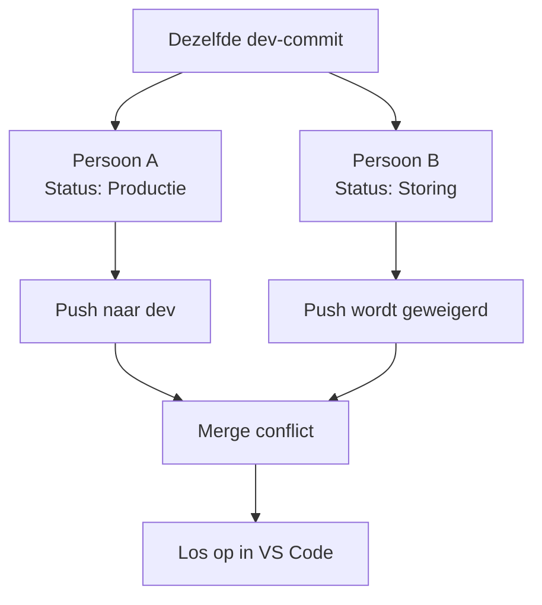

# 3. Ervaar en los een eenvoudig merge conflict op

Eerst laten we bewust zien wat er gebeurt wanneer twee mensen rechtstreeks op dezelfde `dev`-branch werken. Dit is niet de prettigste manier van samenwerken, maar het maakt een conflict heel begrijpelijk.



Gebruik voor persoon A en persoon B ieder een eigen clone van de repository. Beide personen beginnen vanaf dezelfde `dev`-commit.

## Persoon A doet dit

Persoon A opent `view.json`, verandert alleen `Status: Gereed` naar `Status: Productie` en voert uit:

```bash
git switch dev
git pull origin dev
git add projects/demo-project/com.inductiveautomation.perspective/views/demo/view.json
git commit -m "demo: persoon A kiest productie"
git push origin dev
```

## Persoon B doet tegelijk dit

Persoon B heeft al dezelfde oude `dev`-commit open. Persoon B verandert alleen `Status: Gereed` naar `Status: Storing` en voert uit:

```bash
git switch dev
git add projects/demo-project/com.inductiveautomation.perspective/views/demo/view.json
git commit -m "demo: persoon B kiest storing"
git push origin dev
```

De laatste `git push` wordt geweigerd. Dat is goed: Git beschermt de wijziging van persoon A op de remote.

Persoon B haalt nu eerst de wijziging van persoon A op en probeert die te combineren met de eigen commit:

```bash
git fetch origin
git merge origin/dev
```

Nu ontstaat één conflict bij de regel `Status: ...`. Open `view.json` in VS Code. Kies in de Merge Editor de gewenste eindwaarde, bijvoorbeeld `Status: Productie`, en sla op.

We lossen het conflict zo op omdat Git niet kan weten welke van de twee verschillende statussen de juiste is.

Voer daarna uit:

```bash
git add projects/demo-project/com.inductiveautomation.perspective/views/demo/view.json
git commit -m "merge: choose final status"
git push origin dev
```

Alleen de statusregel had een conflict. Dat is precies waarom kleine, duidelijke wijzigingen zo prettig zijn.
