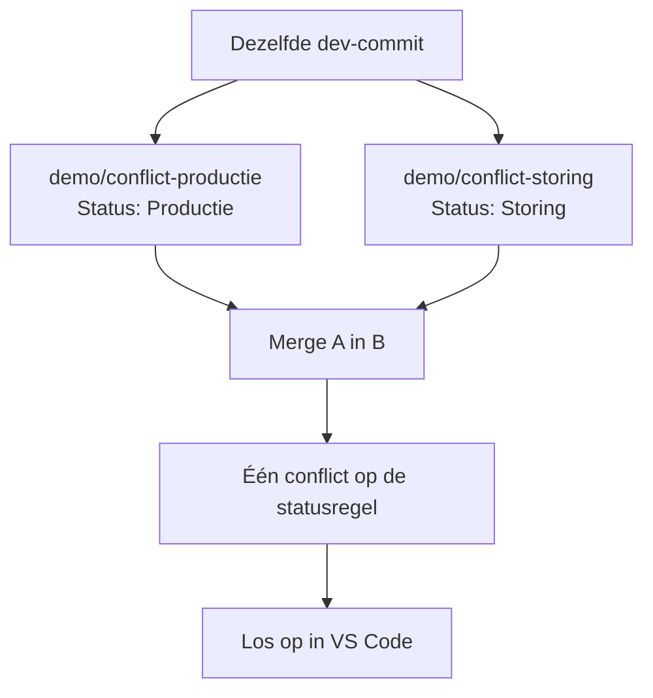

# 3. Ervaar en los een eenvoudig merge conflict op

Voor een goed begrijpelijke conflict-demo hebben we geen tweede computer of tweede clone nodig. We maken op deze ene machine twee tijdelijke branches vanaf dezelfde `dev`-commit. Beide branches veranderen dezelfde statusregel. Wanneer we ze combineren, kan Git niet raden welke tekst de juiste is.



## Maak de eerste keuze

We beginnen op `dev` en maken een tijdelijke branch voor `Status: Productie`:

```bash
git switch dev
git pull origin dev
git switch -c demo/conflict-productie
```

Open `view.json` in VS Code en verander alleen de tekst van `LabelStatus` naar:

```text
Status: Productie
```

Leg die keuze vast:

```bash
git add projects/demo-project/com.inductiveautomation.perspective/views/demo/view.json
git commit -m "demo: status productie"
```

## Maak de andere keuze

Ga terug naar dezelfde `dev`-commit en maak de tweede tijdelijke branch:

```bash
git switch dev
git switch -c demo/conflict-storing
```

Verander in hetzelfde bestand alleen de tekst van `LabelStatus` naar:

```text
Status: Storing
```

Leg ook deze keuze vast:

```bash
git add projects/demo-project/com.inductiveautomation.perspective/views/demo/view.json
git commit -m "demo: status storing"
```

## Laat Git beide keuzes combineren

Nu vragen we Git om de productie-keuze in de storing-branch te mergen:

```bash
git merge demo/conflict-productie
```

Git toont nu één conflict in `view.json`, precies op de regel met `Status: ...`.

Open het bestand in VS Code. In de Merge Editor zie je:

- **Current Change**: `Status: Storing`
- **Incoming Change**: `Status: Productie`

Kies de gewenste eindwaarde, bijvoorbeeld `Status: Productie`, en sla het bestand op. We lossen dit handmatig op omdat Git niet kan weten welke status inhoudelijk juist is.

Rond de oplossing af:

```bash
git add projects/demo-project/com.inductiveautomation.perspective/views/demo/view.json
git commit -m "merge: kies definitieve status"
```

## Breng de opgeloste keuze naar `dev`

De branch bevat nu de oplossing. Voeg die toe aan de gezamenlijke ontwikkelbranch:

```bash
git switch dev
git merge demo/conflict-storing
git push origin dev
```

Alleen de statusregel had een conflict. `LabelMachine` bleef volledig buiten het conflict. In de volgende stap zien we hoe feature branches en Pull Requests dit soort samenwerking beter beheersbaar maken.
