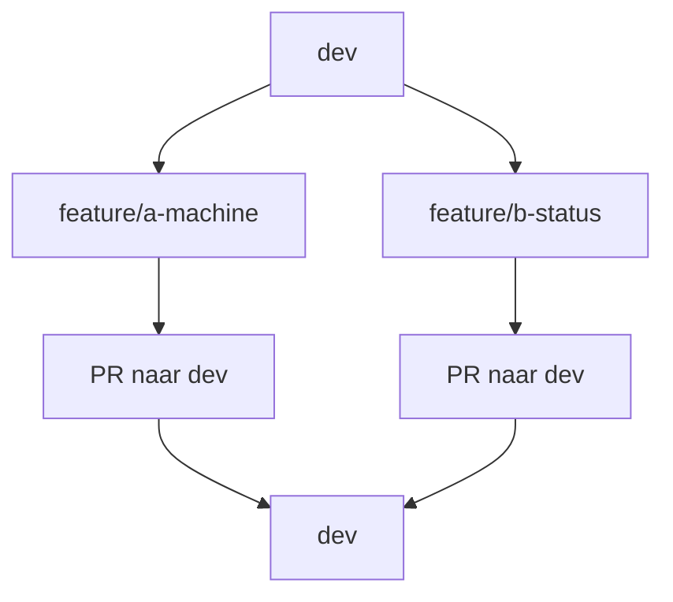

# 4. Werk prettiger samen met feature branches en Pull Requests

Het vorige conflict was leerzaam, maar rechtstreeks op `dev` werken is onhandig. Nu geven we persoon A en B ieder een eigen feature branch. Daardoor zijn wijzigingen eerst rustig te bekijken in een Pull Request voordat ze in `dev` komen.



Conflicten kunnen nog steeds voorkomen als dezelfde regels worden gewijzigd. Ze zijn alleen veel beter te beheren: GitHub laat ze zien vóór de merge en de originele `dev` blijft stabiel.

## Persoon A: eigen branch en PR

Persoon A verandert alleen `Machine: Oefening` naar `Machine: Menglijn 02`.

```bash
git switch dev
git pull origin dev
git switch -c feature/a-machine
git add projects/demo-project/com.inductiveautomation.perspective/views/demo/view.json
git commit -m "feat: persoon A changes machine"
git push -u origin feature/a-machine
```

Maak op GitHub een Pull Request met:

```text
base: dev
compare: feature/a-machine
```

## Persoon B: eigen branch en PR

Persoon B verandert alleen `Status: Productie` naar `Status: In bedrijf`.

```bash
git switch dev
git pull origin dev
git switch -c feature/b-status
git add projects/demo-project/com.inductiveautomation.perspective/views/demo/view.json
git commit -m "feat: persoon B changes status"
git push -u origin feature/b-status
```

Maak op GitHub een Pull Request met:

```text
base: dev
compare: feature/b-status
```

Merge beide Pull Requests naar `dev`, één voor één. De wijzigingen zitten op verschillende regels, dus Git kan ze automatisch combineren.

Je ziet nu het belangrijkste voordeel: iedereen kan veilig werken op een eigen branch, de diff wordt besproken in een PR en `dev` krijgt alleen gecontroleerde merges.
