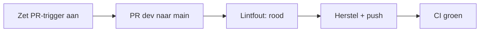

# 5. Zet CI aan en zie rood daarna groen

Nu is het moment om CI zichtbaar te maken. Tot nu toe waren de Pull Requests naar `dev` bewust zonder automatische checks. We zetten CI nu aan voor de release-PR van `dev` naar `main`.



Open `.github/workflows/ci.yml` in VS Code. Vervang dit blok:

```yaml
on:
  workflow_dispatch:
```

door dit blok:

```yaml
on:
  pull_request:
    branches: [main]
```

Maak tegelijk in `view.json` één bewuste lintfout: verander alleen `LabelMachine` naar `machine`.

Zet beide wijzigingen op `dev`:

```bash
git switch dev
git add .github/workflows/ci.yml
git add projects/demo-project/com.inductiveautomation.perspective/views/demo/view.json
git commit -m "ci: enable pull request checks"
git push origin dev
```

Maak nu op GitHub de release-PR:

```text
base: main
compare: dev
```

De check is rood. Open in GitHub de Actions-log. In `ci.yml` gebeurt het volgende:

1. GitHub checkt de PR-code uit.
2. Python installeert `ign-lint`.
3. `scripts/validate.sh` controleert of alle project-JSON gelezen kan worden en of de twee demo-labels bestaan.
4. `ign-lint` leest `rule_config.json` en controleert de Perspective-view op componentnamen, foute componentverwijzingen en te snelle polling.

De fout is hier bewust eenvoudig: `machine` is geen PascalCase-componentnaam.

Herstel in `view.json` `machine` weer naar `LabelMachine` en voer uit:

```bash
git add projects/demo-project/com.inductiveautomation.perspective/views/demo/view.json
git commit -m "fix: restore component name"
git push origin dev
```

Dezelfde PR krijgt automatisch een nieuwe run. Nu is de check groen en kan de release verder.
