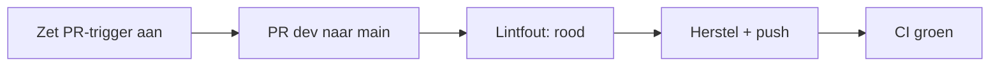

# 5. Zet CI aan en zie rood daarna groen

Nu is het moment om CI zichtbaar te maken. Tot nu toe waren de Pull Requests naar `dev` bewust zonder automatische checks. We zetten CI nu aan voor de release-PR van `dev` naar `main`.



## Eenmalig: GitHub Actions inschakelen

Controleer vóór deze stap dat GitHub Actions voor de repository aan staat. Ga op GitHub naar **Settings → Actions → General**, kies onder **Actions permissions** voor **Allow all actions and reusable workflows** en sla op. In een organisatie kan deze keuze door een organisatiebeleid zijn vastgezet.

Je hoeft de workflow niet eerst naar `main` te mergen: een `pull_request`-workflow op `dev` draait voor een PR van `dev` naar `main`. De workflow moet wel in de commit staan die je naar `dev` pusht.

Open `.github/workflows/ci.yml` in VS Code. Vervang dit blok:

```yaml
on:
  workflow_dispatch:
```

door dit blok:

```yaml
on:
  pull_request:
    branches: [main]
```

Zaai tegelijk één bewuste lintfout:

```bash
bash scripts/seed-linter-issues.sh
```

Dit verandert alleen `LabelMachine` naar `machine` in de demo-view.

De JSON blijft daarbij bewust geldig. In de GitHub Actions-log zie je daarom **Check 1/2** slagen en **Check 2/2** falen. De demo toont dus één concrete lintregel, niet alle mogelijke lintregels tegelijk.

Zet beide wijzigingen op `dev`:

```bash
git switch dev
git add .github/workflows/ci.yml
git add projects/demo-project/com.inductiveautomation.perspective/views/demo/view.json
git commit -m "ci: enable pull request checks"
git push origin dev
```

Maak nu op GitHub de release-PR:

```text
base: main
compare: dev
```

De check is rood. Open in GitHub de Actions-log. In `ci.yml` gebeurt het volgende:

1. GitHub checkt de PR-code uit.
2. Python installeert `ign-lint`.
3. `scripts/validate.sh` voert alle projectchecks uit en schrijft per controle duidelijk `PASS`, `FAIL` of `SKIP` naar de Actions-log.
4. Eerst controleert het script alle project-JSON en de twee demo-labels; daarna leest `ign-lint` `rule_config.json` en controleert het de Perspective-view.

## Welke checks draaien er?

Deze demo gebruikt twee soorten controles:

- `scripts/validate.sh` leest ieder JSON-bestand om syntaxfouten te vinden en controleert dat de demo-view `LabelMachine` en `LabelStatus` bevat.
- `ign-lint` voert de drie regels uit die in `rule_config.json` zijn ingeschakeld: componentnamen moeten PascalCase zijn, componentverwijzingen moeten naar bestaande componenten wijzen, en polling mag niet sneller dan iedere 1000 ms plaatsvinden. Eigenschapsnamen worden als waarschuwing op camelCase gecontroleerd.

De fout is hier bewust eenvoudig: `machine` is geen PascalCase-componentnaam.

Herstel de fout met:

```bash
bash scripts/unseed-linter-issues.sh
```

Commit en push vervolgens:

```bash
git add projects/demo-project/com.inductiveautomation.perspective/views/demo/view.json
git commit -m "fix: restore component name"
git push origin dev
```

Dezelfde PR krijgt automatisch een nieuwe run. Nu is de check groen en kan de release verder.

## Accepteer de release-PR

Controleer in GitHub nog één keer de richting van de Pull Request:

```text
base: main
compare: dev
```

Klik op **Merge pull request**. Werk daarna je lokale `main` bij:

```bash
git switch main
git pull origin main
```

De geteste wijziging staat nu op `main`, klaar om in de volgende stap te taggen en naar productie te deployen.
