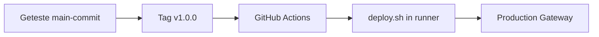

# 6. Maak een Git tag en deploy naar productie

Nu maken we van de geteste `main`-commit een release. Een tag is een vaste naam voor precies één commit, bijvoorbeeld `v1.0.0`. De production-workflow start alleen bij een tag die begint met `v`.



## Eenmalig: sleutels en automatische runner instellen

De deploy moet bij de lokale Docker-container kunnen. Daarom start je in deze
stap een kleine runnercontainer die de release automatisch uitvoert. Hij neemt
één job aan, stopt daarna en schrijft zich automatisch uit bij GitHub. Er blijft
dus geen actieve runner op de laptop staan.

1. Open de production Gateway: `http://localhost:8090` en maak via
   **Config → Security → API Keys** een **Ignition API key** met rechten voor
   de projectscan. Deze key gebruikt de deploy na `docker cp` om Ignition te
   vragen de nieuwe projectbestanden in te lezen.
2. Maak daarna een **GitHub Personal Access Token (PAT)**. Dit is een GitHub
   API-toegangstoken: de runnercontainer gebruikt hem om zichzelf tijdelijk bij
   deze GitHub-repository te registreren. Ga naar **GitHub → jouw avatar →
   Settings → Developer settings → Personal access tokens → Tokens (classic)
   → Generate new token (classic)**. Kies nadrukkelijk geen fine-grained token
   en vink de volledige scope **`repo`** aan.
3. Open jouw lokale `.env` en vul eerst de Ignition-key, daarna de
   GitHub-PAT en repository-URL in:

   ```text
   IGNITION_API_KEY=jouw-productie-api-key
   RUNNER_REPO_URL=https://github.com/jouw-gebruikersnaam/ignition-cicd-demo
   RUNNER_GITHUB_PAT=ghp_jouw_token
   ```

   `.env` wordt niet gecommit. De GitHub-PAT registreert alleen de tijdelijke
   runner; de Ignition API key vraagt Ignition na de deploy om een projectscan.

4. Start de tijdelijke runner vlak vóór je de release tag pusht:

   ```bash
   docker compose --profile demo-cd up -d github-runner
   ```

   De runner krijgt automatisch de labels `self-hosted` en `ignition-demo`.
   Controleer vóór je de tag pusht of de runner klaarstaat:

   ```bash
   docker compose --profile demo-cd logs --tail 30 github-runner
   ```

   De log moet aangeven dat de runner op jobs wacht. Zie je een `404` of
   `Invalid configuration provided for token`, maak dan een nieuwe **classic**
   PAT met scope `repo` en start alleen de runner opnieuw.

Maak en push de tag:

```bash
git switch main
git pull origin main
git tag -a v1.0.0 -m "Demo release v1.0.0"
git push origin v1.0.0
```

Open daarna GitHub **Actions → Deploy production**. De tijdelijke runner pakt
de job automatisch op, controleert de tag en JSON-bestanden, voert
`scripts/deploy.sh` uit en kopieert de getagde bestanden naar productie. Wacht
tot de run groen is; je hoeft geen lokaal deploy-script te starten.

In de correcte workflow zie je achtereenvolgens **Check out release tag**,
**Verify tag is on main**, **Validate project JSON** en **Ship files, scan, and
smoke-check**. Zie je in plaats daarvan **Verify prerequisites**, dan draait de
tag nog de oude workflowversie. Commit en push eerst de runnerwijzigingen en
maak daarna een nieuwe tag (bijvoorbeeld `v1.0.2`); bestaande tags veranderen
niet.

Na een geslaagde job stopt en deregistreert de runner vanzelf. Verwijder de
gestopte container met dit commando (dit stopt de Gateways niet):

```bash
docker compose --profile demo-cd rm -f github-runner
```

## Wat gebeurt er technisch?

In `.github/workflows/deploy-production.yml` gebeurt het volgende:

1. De workflow start alleen bij `v*`-tags.
2. Hij controleert dat de tag-commit onderdeel is van `main`.
3. De tijdelijke runner valideert alle JSON-bestanden in de exacte getagde release.
4. Hij roept automatisch `scripts/deploy.sh` aan.

In `scripts/deploy.sh` gebeurt vervolgens dit:

1. `docker cp` kopieert `projects/demo-project` uit de getagde repository naar `ignition-demo-production`.
2. De Gateway krijgt een beveiligde projectscan via de API key.
3. `/StatusPing` controleert of de Gateway daarna nog `RUNNING` is.

## Bewijs dat productie de release heeft

Open de production-view en ververs de pagina:

```text
http://localhost:8090/data/perspective/client/demo-project/
```

Je ziet dezelfde labelteksten die via `dev`, de PR en `main` in de getagde release zijn gekomen.

Je kunt ook direct in de production-container zien welk bestand is gedeployed:

```bash
docker exec ignition-demo-production grep -n '"text"' /usr/local/bin/ignition/data/projects/demo-project/com.inductiveautomation.perspective/views/demo/view.json
```

Dit laat zien dat productie niet jouw onopgeslagen lokale werkmap gebruikt. Productie gebruikt uitsluitend de versie die in Git is gemerged en daarna getagd.
