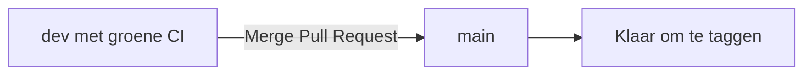

# 6. Merge `dev` naar `main`

De release-PR is nu groen. We hebben dus een duidelijke scheiding: `dev` bevat het gezamenlijke werk; `main` krijgt alleen de gecontroleerde versie.



Controleer in GitHub nog één keer de richting van de Pull Request:

```text
base: main
compare: dev
```

Klik daarna **Merge pull request**.

Werk je lokale `main` bij:

```bash
git switch main
git pull origin main
git log --oneline --graph --decorate -5
```

Je ziet nu de samengevoegde wijziging op `main`. Er gebeurt nog geen productie-deploy: die komt bewust pas in de volgende stap, wanneer we deze commit een release-tag geven.
