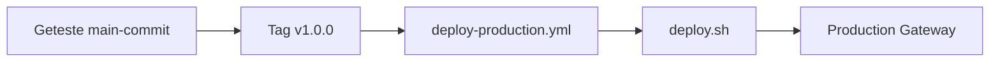

# 7. Maak een Git tag en deploy naar productie

Nu maken we van de geteste `main`-commit een release. Een tag is een vaste naam voor precies één commit, bijvoorbeeld `v1.0.0`. De production-workflow start alleen bij een tag die begint met `v`.



Maak en push de tag:

```bash
git switch main
git pull origin main
git tag -a v1.0.0 -m "Demo release v1.0.0"
git push origin v1.0.0
```

Open daarna GitHub **Actions → Deploy production**.

## Wat gebeurt er technisch?

In `.github/workflows/deploy-production.yml` gebeurt het volgende:

1. De workflow start alleen bij `v*`-tags.
2. Hij controleert dat de tag-commit onderdeel is van `main`.
3. Hij gebruikt de self-hosted runner, omdat alleen die de lokale Docker-container kan bereiken.
4. Hij haalt GitHub Secret `IGNITION_API_KEY` op.
5. Hij roept `scripts/deploy.sh` aan.

In `scripts/deploy.sh` gebeurt vervolgens dit:

1. `docker cp` kopieert `projects/demo-project` uit de getagde repository naar `ignition-demo-production`.
2. De Gateway krijgt een beveiligde projectscan via de API key.
3. `/StatusPing` controleert of de Gateway daarna nog `RUNNING` is.

## Bewijs dat productie de release heeft

Open de production-view en ververs de pagina:

```text
http://localhost:8090/data/perspective/client/demo-project/
```

Je ziet dezelfde labelteksten die via `dev`, de PR en `main` in de getagde release zijn gekomen.

Je kunt ook direct in de production-container zien welk bestand is gedeployed:

```bash
docker exec ignition-demo-production grep -n '"text"' /usr/local/bin/ignition/data/projects/demo-project/com.inductiveautomation.perspective/views/demo/view.json
```

Dit laat zien dat productie niet jouw onopgeslagen lokale werkmap gebruikt. Productie gebruikt uitsluitend de versie die in Git is gemerged en daarna getagd.
